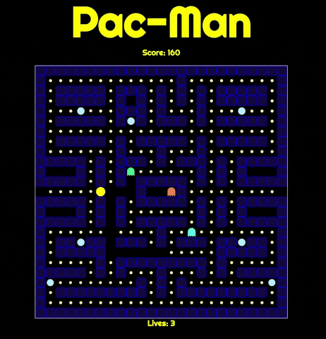

#PAC-MAN

The classic Pac-Man game with the same retro feel!
[Try it out!](https://alibhimani.com/pacman) 

(Only works on a large screen device at the moment)

This was my first project during the Software Engineering Immersive course at General Assembly London.

##Brief
Pac Man is a classic arcade game from the 80s. The player aims eat all the food in a maze whilst being hunted by ghosts.
The aim is to achieve the highest score possible before being killed by the ghosts.

###Requirements
- The player should be able to clear at least one board
- The player's score should be displayed at the end of the game

##Technologies Used
- HTML5
- CSS3
- JavaScript (ES6)
- Git/GitHub
- Adobe Photoshop 2020
- Google Fonts

##Planning
I began this project by planning out all the different classes I would need. These were:

- Pac-Man
- Ghosts (named Greeny, Pinky, Blueboy and Clyde, a tribute to the names of the original Pac-Man ghosts)
- Small pellets (named smalldot)
- Power pellets (named bigdot)
- Walls
- Wrap (the gates on the left and right which allow Pac-Man and the ghosts to teleport from one side of the maze to the other)
- Door (the door for the ghosts to exit their holding pen)

##Future Improvements
###Additional Features
This project is far from complete! There are many features I would like to add. These include:

- Pathfinding for the ghosts to actually track Pac-Man rather than moving randomly
- Scared mode where the ghosts run away from Pac-Man upon the consumption of a power pellet by the player, truer to the original game
- Mobile-friendly
- Save highscores using local storage
- Additional levels with differently styled mazes
- Sound off
- Pause game

###Bugs
Currently there are cells on the grid where the ghosts can get stuck. Additionally there are cells where the ghosts can't reach. In theory, once a pathfinding algorithm is implemented, the ghosts will be able to escape areas where they are trapped and travel to all cells, thus fixing the bug. 

Another bug is that if the player changes direction into a wall or the opposite direction they are currently travelling, Pac-Man freezes. To fix this I am going to adjust Pac-Man so that he carries on moving but checks his surroundings and only changes to the user-stated direction when it is possible to do so, again, truer to the original game.

###Styling
In the future I would like to add eyes to the ghosts which look towards Pac-Man. I have also been working on Pac-Man's mouth which will face the direction he his moving as well as open and close as he moves and eats pellets.

